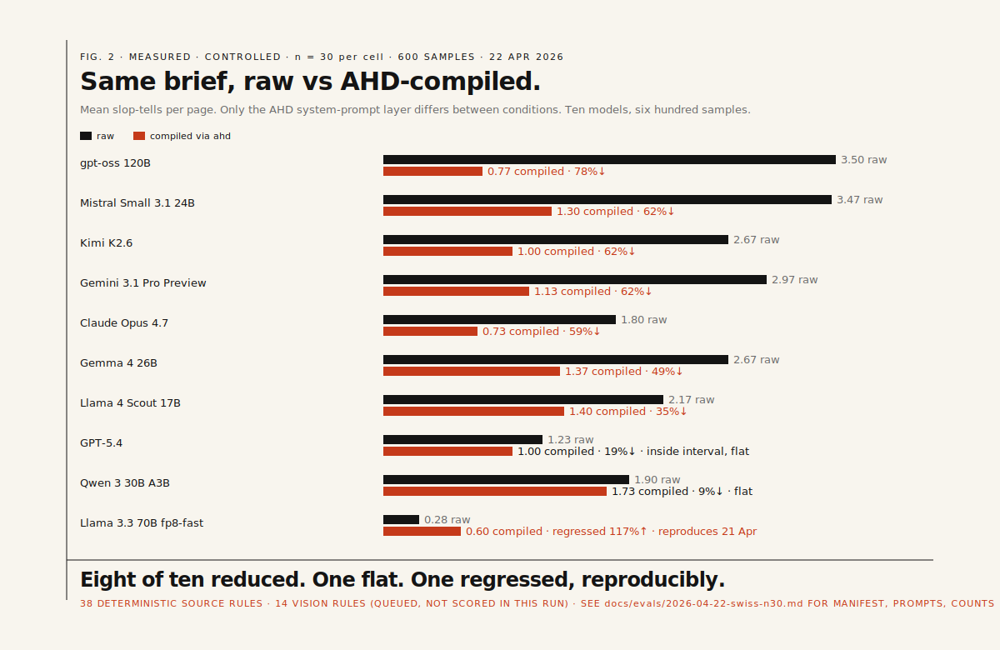
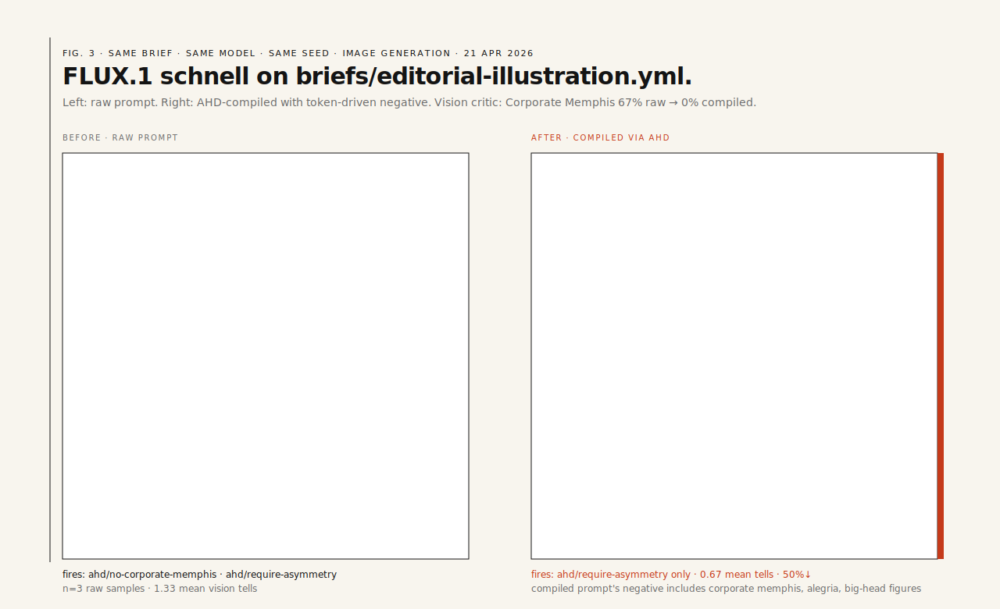

<div align="center">


</div>

<br>

**AHD is a guardrail and evaluation layer for AI-generated design** — web UI, graphic design, illustration, image generation. Not a generator itself. Four pieces: a named taxonomy of AI design slop that spans web and graphic surfaces, style tokens as promptable design direction, a brief compiler that turns intent into constrained model instructions, and a reproducible eval loop that scores raw vs compiled output against the taxonomy. Positioning in full: [docs/POSITIONING.md](docs/POSITIONING.md).

The product's one-line promise: **AHD measures and reduces specific, repeated AI design failures, across web and image generation.** The thirty-nine-tell taxonomy is named, versioned, and linted; per-token forbidden lists and required quirks are enforced in CI; every eval publishes attempted counts, canonical model ids, extraction failures, per-model deltas and negative results. That combination — taxonomy + reproducible scoring — is the moat, not the prompts.

Today's shipped scope covers both verticals. **Web UI end-to-end**: text-to-HTML runners for Claude, GPT, Gemini and OSS models via Cloudflare Workers AI (plus subscription-CLI variants for the frontier three), a thirty-eight-rule source linter (35 HTML/CSS + 3 SVG), a fourteen-rule vision critic, a five-rule mobile-layout audit (`ahd audit-mobile` against a 375px viewport), Playwright screenshots, an MCP server and scoped ESLint / Stylelint plugins. **Image generation end-to-end**: `ahd eval-image` pipeline with a Cloudflare Workers AI image runner (FLUX, SDXL, DreamShaper), four image-specific vision rules added to the critic (malformed anatomy, Midjourney face symmetry, decorative cursive in renders, stock diversity casting), a three-rule SVG source linter (uniform-stroke, palette-bounds, perfect-symmetry) and two image-first tokens (`editorial-illustration`, `ad-creative-collision`). Additional image runners (Replicate, DALL·E 3, Imagen, Firefly) are the remaining adapter work.

---

## Measured, controlled, published



Ran `briefs/landing.yml` against **ten models, n=30 per cell, six hundred samples** on 22 April 2026. Raw and compiled conditions differ only in the AHD system-prompt layer. Three frontier cells used subscription CLIs (Claude Code, Codex, Gemini CLI); seven OSS cells used the Cloudflare Workers AI free tier. Full report, per-cell attempted/scored counts, per-tell frequency tables, run manifest: [docs/evals/2026-04-22-swiss-n30.md](docs/evals/2026-04-22-swiss-n30.md).

| Model | Raw → compiled | Reduction | Notes |
|---|---:|---:|---|
| `cf:@cf/openai/gpt-oss-120b` | 3.50 → 0.77 | **78.1%** | 30/30 scored; best reduction in the run |
| `cf:@cf/mistralai/mistral-small-3.1-24b-instruct` | 3.47 → 1.30 | 62.5% | 30/30 scored |
| `cf:@cf/moonshotai/kimi-k2.6` | 2.67 → 1.00 | 62.5% | 30/30 after a chat-template fix for thinking-mode; see [docs/SERVING_TELLS.md](docs/SERVING_TELLS.md) |
| `gemini-3.1-pro-preview` (Gemini CLI) | 2.97 → 1.13 | 61.8% | 30/30 scored |
| `claude-opus-4-7` (Claude Code CLI) | 1.80 → 0.73 | 59.3% | 30/30 scored |
| `cf:@cf/google/gemma-4-26b-a4b-it` | 2.67 → 1.37 | 48.7% | 30/30 scored |
| `cf:@cf/meta/llama-4-scout-17b-16e-instruct` | 2.17 → 1.40 | 35.4% | 30/30 scored |
| `gpt-5.4` (Codex CLI) | 1.23 → 1.00 | 18.9% | 30/30; inside the Wilson interval, read as flat |
| `cf:@cf/qwen/qwen3-30b-a3b-fp8` | 1.90 → 1.73 | 8.8% | 30/30; flat |
| `cf:@cf/meta/llama-3.3-70b-instruct-fp8-fast` | 0.28 → **0.60** | **−117.5%** | 30/30; **regressed**, reproduces the 21 April cross-provider result |

Eight of ten cells move in the direction the framework promises. One flat, one regression. The top four cells span four model families and four serving paths (gpt-oss via CF, Mistral via CF, Claude via Claude Code CLI, Gemini via Gemini CLI), so the result is not a single-provider artefact. At n=30 the Wilson interval tightens from roughly ±35 points at n=5 to roughly ±18 points; the top four cells sit well outside that band.

The Llama 3.3 70B regression reproduces the same-direction result seen in the 21 April n=5 cross-provider run on two independent serving paths. The framework correctly reports that compiled does not help every model, and the 22 April run upgrades that from a single-n=5 signal to a multi-provider, n=30 finding.

Scope: one brief, one token, one surface, source-linter only. External-validity passes (different-token-same-brief, different-brief-same-token, vision-critic coverage over the existing 600 samples) are queued. The 21 April cross-provider run with seven models is preserved at [docs/evals/2026-04-21-swiss-cross.md](docs/evals/2026-04-21-swiss-cross.md); the 21 April five-model narrow-roster run is at [docs/evals/2026-04-21-swiss.md](docs/evals/2026-04-21-swiss.md).

A partial vision-critic pass in the earlier run (21 of 48 screenshots, limited by Anthropic's 30k tok/min rate cap at the time) found **only one vision-only rule fire** (`mesh-has-counterforce` on a single raw sample). Interpretation: the editorial-landing brief does not elicit the iridescent-blob / Corporate-Memphis / laptop-stock-photo failure modes the vision layer was built to catch; the source linter already covers the failure modes these models exhibit on this brief. Full vision report: [docs/evals/2026-04-21-swiss-vision.md](docs/evals/2026-04-21-swiss-vision.md).

The original **21 April 2026 n=5 narrow-roster run** is preserved below as the baseline the n=30 run replaced. Same brief, same seed, five models, n=5 per cell. The Claude 100% reduction visible there has an implicit ±35-point Wilson interval; the n=30 figure above (59%) is the tighter, quotable number, and the picture it paints is the same shape seen at wider resolution.


A rendered raw vs compiled pair from the Mistral text run, same brief, same seed:


## Image generation works the same way

The v0.6 image-generation vertical is shipped. `ahd eval-image` runs a brief through any set of image models (Cloudflare Workers AI image models today, Replicate and frontier providers on the roadmap), saves raw and compiled PNGs, and scores each with the vision critic against the fourteen vision-only rules. Ran `briefs/editorial-illustration.yml` against two models on 21 April 2026, n=3 per cell.

| Model | Raw mean tells | Compiled | Reduction |
|---|---:|---:|---:|
| `cfimg:@cf/black-forest-labs/flux-1-schnell` | 1.33 | 0.67 | 50% |
| `cfimg:@cf/bytedance/stable-diffusion-xl-lightning` | 1.33 | 1.33 | 0% |

FLUX respected the compiled prompt's negative and went from 67% Corporate-Memphis-fire on raw to 0% on compiled. SDXL Lightning ignored the negative entirely. This is a real finding: image-generation models vary in how seriously they take a negative-prompt list, and a framework that treats them as equivalent would lie about the numbers.



Full report with per-tell counts and the prompts used: [docs/evals/2026-04-21-editorial-image.md](docs/evals/2026-04-21-editorial-image.md).

---

## What AHD ships

**Taxonomy.** Thirty-nine slop tells documented in [docs/SLOP_TAXONOMY.md](docs/SLOP_TAXONOMY.md) and [docs/LINTER_SPEC.md](docs/LINTER_SPEC.md). Enforced today by 35 HTML/CSS rules, 3 SVG rules, and 14 vision-critic rules. The rule count is higher than the taxonomy count because several taxonomy entries are covered by more than one rule (for example, "Corporate Memphis" is enforced by a vision rule on rendered pixels and by the `no-corporate-memphis` negative in the compiled image prompt).

**Brief compiler.** `ahd compile <brief.yml>` takes a structured brief, resolves it against a named style token, emits a `spec.json` plus per-model system prompts. `--mode final` produces single-shot output constraints (used by `ahd try` and by `ahd eval-live`); default mode is `draft`, which asks the model for three divergent directions for human-in-the-loop exploration.

**Slop linter.** `ahd lint <file.html|css|svg>` runs 35 HTML/CSS rules plus 3 SVG rules, in one pass against whatever input kind it's given. `eslint-plugin-ahd` and `stylelint-plugin-ahd` wrap the rule engine for editor integration.

**Live-model eval.** `ahd eval-live <token> --brief b.yml --models <specs> --n N --report r.md` runs a controlled raw-vs-compiled comparison across Claude, GPT, Gemini, OSS models via Cloudflare Workers AI (free tier), and deterministic mock runners. Reports attempted, extractionFailed, errored and scored counts per cell; canonical model ids preserved via `evals/<token>/manifest.json`.

**Vision critic.** `ahd critique <token>` renders each sample via headless Chromium and runs a multimodal vision model against 14 vision-only rules (9 web/graphic, 4 image-specific, 1 layout), with rate-limit-aware retry/backoff. `--critic claude-code` (default) runs via Claude Code subscription for zero API cost; `--critic anthropic` runs via HTTP API and needs `ANTHROPIC_API_KEY`; `--critic mock` runs offline for deterministic tests. Chromium is resolved via `AHD_CHROMIUM_PATH` / `PATH`; use `nix-shell` (the flake's devShell provides `pkgs.chromium`) rather than `npx playwright install`.

**MCP server.** `ahd mcp-serve` exposes `ahd.brief`, `ahd.list_tokens`, `ahd.get_token`, `ahd.palette`, `ahd.type_system`, `ahd.reference`, `ahd.lint`, `ahd.vision_rules` over stdio JSON-RPC for any MCP-capable agent (Claude Code, Cursor, Windsurf, Zed).

**Ten style tokens.** `swiss-editorial`, `manual-sf`, `neubrutalist-gumroad`, `post-digital-green`, `monochrome-editorial`, `memphis-clash`, `heisei-retro`, `bauhaus-revival`, `editorial-illustration`, `ad-creative-collision`. Eight target web/editorial surfaces; the last two target image generation. Each declares grid (or composition, for image tokens), type, OKLCH palette, forbidden list, required quirks, reference lineage and per-model prompt fragments. Schema in [docs/STYLE_TOKEN_SCHEMA.md](docs/STYLE_TOKEN_SCHEMA.md).

---

## What AHD does not do

AHD does not generate design on your behalf. There is no `ahd generate` command that hands you a page or an image. The framework compiles a brief into prompts and a spec (`ahd compile`), exposes that spec to any MCP-capable agent (`ahd mcp-serve`), and scores whatever a generator produces afterward (`ahd lint`, `ahd eval-live`, `ahd eval-image`, `ahd critique`). Generation itself is someone else's concern: your agent, your editor, a direct API call using the compiled prompt fragments. This is a deliberate product line. The value AHD adds is the taxonomy and the scoring; a generator is a separate product.

The result-oriented flow looks like this. Run `ahd compile briefs/your-brief.yml --out ./out`. Take `out/prompt.generic.md` (or the `claude` / `gpt` / `gemini` variant) and pass it to your model of choice as a system prompt. Then run `ahd lint` on what comes back.

## Prior art

Pieces of AHD exist. The combination does not.

- **Prompt libraries for AI UI generation** — [uiprompt.io](https://uiprompt.io/), [Promter](https://promter.dev/), GenDesigns, WebGardens. Structured prompts / style recipes for v0, Lovable, Bolt, Claude, Cursor. Overlap: encoded style direction. Divergence: no taxonomy, no eval.
- **Design-token linting** — [`@lapidist/design-lint`](https://design-lint.lapidist.net/), [`stylelint-design-tokens-plugin`](https://www.npmjs.com/package/stylelint-design-tokens-plugin). Enforce token/component consistency in source. Divergence: AHD's rules target AI-generated slop patterns, not adherence to an internal design system.
- **Figma / design-system audit** — [DesignLint AI](https://www.designlintai.tech/). Audits Figma files against token rules. Divergence: AHD audits rendered HTML, not design files, and scopes to AI-generated output.
- **AI UI benchmarks** — [UI Bench](https://ui-bench.dev/). Scores generated HTML on engineering quality (static analysis, axe, Lighthouse, semantics). Divergence: UI Bench rates a page's engineering quality; AHD rates a page's *slop fingerprint* under a paired raw-vs-compiled control.

What nobody else ships: a named AI-slop taxonomy + token-driven brief compiler + deterministic linter for the taxonomy + raw-vs-compiled empirical eval, in one reproducible project.

---

## Install

```bash
npm install -g @adastracomputing/ahd
# or, from source (reproducible):
git clone https://github.com/Ad-Astra-Computing/ahd.git
cd ahd && nix develop . && npm install && npm run build
```

Requires Node 20+. Screenshot rendering requires `chromium` available on `PATH`; the flake's `devShell` provides one.

---

## Use

```bash
ahd list                                      # style tokens
ahd show swiss-editorial                      # inspect one
ahd compile brief.yml --out ./out             # per-model prompts + spec.json
ahd lint page.html                            # 35 HTML/CSS rules + 3 SVG rules
ahd vision-rules                              # the 14 vision-only rules (9 web/graphic + 4 image + 1 layout)
ahd mcp-serve                                 # MCP server over stdio

# Controlled eval, OSS-only (free tier, no Anthropic/OpenAI account needed)
CF_API_TOKEN=… CF_ACCOUNT_ID=… \
  ahd eval-live swiss-editorial \
    --brief briefs/landing.yml \
    --models cf:@cf/meta/llama-3.3-70b-instruct-fp8-fast,cf:@cf/mistralai/mistral-small-3.1-24b-instruct \
    --n 5 \
    --report docs/evals/$(date +%Y-%m-%d)-oss.md

# Plus frontier via provider API keys (CF_AI_GATEWAY optional proxy)
ahd eval-live swiss-editorial \
  --brief briefs/landing.yml \
  --models claude-opus-4-7,gpt-5,gemini-3.1-pro-preview,cf:@cf/mistralai/mistral-small-3.1-24b-instruct \
  --n 10 \
  --report docs/evals/latest.md

# Frontier via subscription CLIs (Claude Code / Codex / Gemini CLI,
# no API billing; requires the CLIs on PATH and logged in)
ahd eval-live swiss-editorial \
  --brief briefs/landing.yml \
  --models claude-code:claude-opus-4-7,codex-cli:gpt-5.4,gemini-cli:gemini-3.1-pro-preview,cf:@cf/meta/llama-3.3-70b-instruct-fp8-fast \
  --n 10 \
  --report docs/evals/latest.md

# Vision layer over the rendered screenshots
ahd critique swiss-editorial \
  --samples evals \
  --critic anthropic \
  --report docs/evals/latest-vision.md
```

A minimal brief:

```yaml
intent: "landing page for a small indie music label's 2026 roster"
audience: "artists and their managers, not fans"
token: swiss-editorial
surfaces: [web]
mustInclude:
  - "a release calendar in the page, not in a modal"
mustAvoid:
  - "any reference to Web3"
```

---

## Limits

- **Scope of the published numbers.** The 22 April n=30 run is one brief (`landing.yml`) against one token (`swiss-editorial`) against one surface. External-validity passes (different-token-same-brief, different-brief-same-token) are queued. Do not read one row as "model X is better than model Y at design" in general; different tokens and briefs produce different orderings.
- **Source-linter only in the published run.** The 38 source-level rules scored here cover roughly three quarters of the taxonomy. The 14 vision rules on rendered pixels are run on a monthly cadence via the automated eval workflow, not inside every live-eval pass; a cell that looks clean by source can still fire vision tells.
- **The linter is a proxy metric.** Fewer tells is not identical to better design. A page can pass every rule and still be bad. AHD narrows the output; a human still picks.
- **Some models regress under compile.** Llama 3.3 70B gets worse, not better, with the long system prompt. We do not bury that; the chart shows it, and the finding reproduces across two independent serving paths.
- **Taxonomy is calibrated for AI design slop, not all failure modes.** Accessibility, performance, copy quality beyond banned phrases, brand fit are not AHD's domain.

Roadmap: [docs/ROADMAP.md](docs/ROADMAP.md). Testing strategy: [docs/TESTING.md](docs/TESTING.md).

---

## Licence

Code is released under the **Functional Source License 1.1, Apache 2.0 Future License** (FSL-1.1-Apache-2.0). Full text in [LICENSE](LICENSE). Free for any non-competing purpose including internal use, client work, education and research; the one restriction is building a commercial AHD-alike product. Each release auto-converts to Apache-2.0 on its second anniversary.

Style tokens in [tokens/](tokens/) and documentation artwork in [docs/artwork/](docs/artwork/) are **CC-BY-4.0**, unless an individual token's `licence:` field says otherwise. Tokens are meant to proliferate, use them on client work, in your own products, wherever. Attribution strings are in [LICENSE-tokens](LICENSE-tokens) and [NOTICE](NOTICE).
