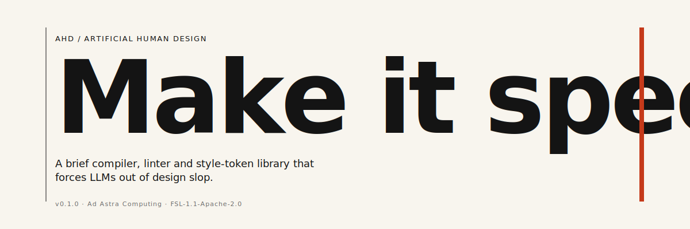
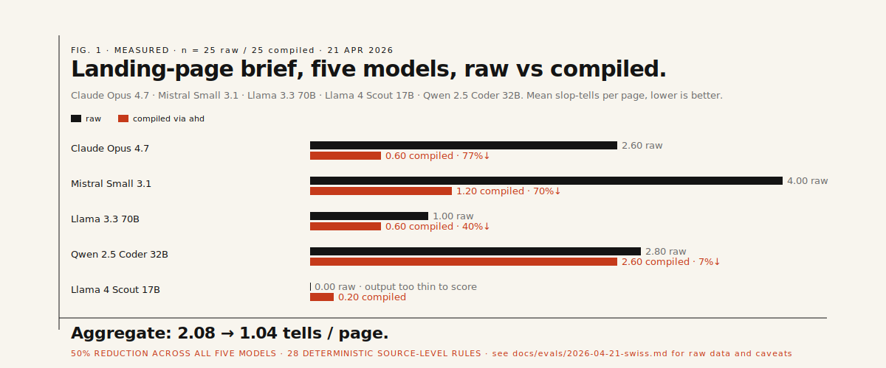
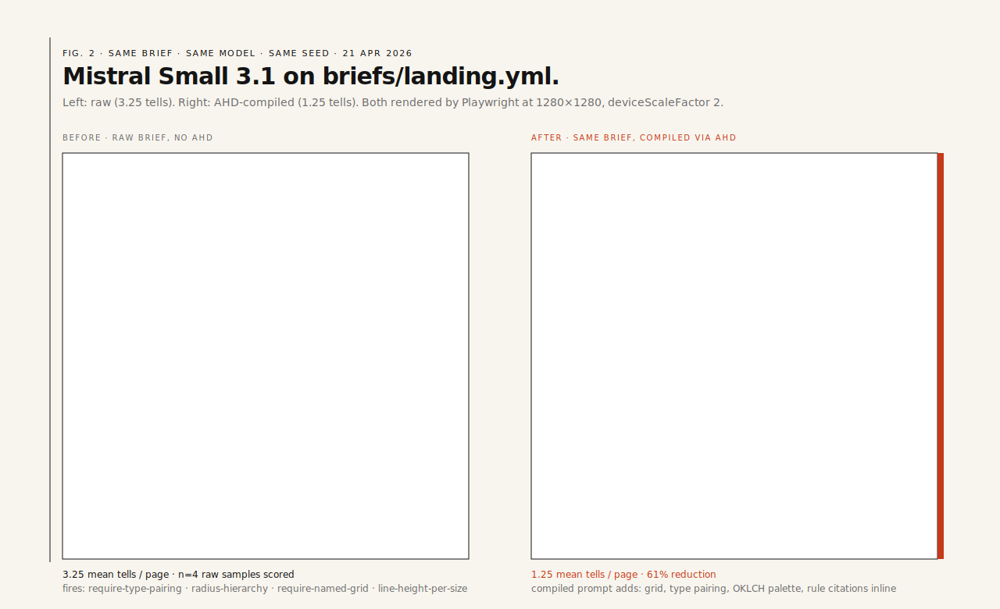

<div align="center">



</div>

<br>

**AHD is a guardrail and evaluation layer for AI-generated UI.** Not a design generator. Four pieces: a named taxonomy of AI design slop, style tokens as promptable design direction, a brief compiler that turns intent into constrained model instructions, and a reproducible eval loop that measures raw vs compiled output against the taxonomy. Positioning in full: [docs/POSITIONING.md](docs/POSITIONING.md).

The product's one-line promise: **AHD measures and reduces specific, repeated AI design failures.** The thirty-eight-tell taxonomy is named, versioned, and linted; per-token forbidden lists and required quirks are enforced in CI; every eval publishes attempted counts, canonical model ids, extraction failures, per-model deltas and negative results. That combination — taxonomy + reproducible scoring — is the moat, not the prompts.

---

## Measured, controlled, published



Ran `briefs/landing.yml` against five models on 21 April 2026, n=5 per cell, raw and compiled conditions differing only in the AHD system-prompt layer. Full report, manifest, prompts, attempted-vs-scored counts: [docs/evals/2026-04-21-swiss.md](docs/evals/2026-04-21-swiss.md).

| Model | Raw → compiled | Reduction | Notes |
|---|---:|---:|---|
| `claude-opus-4-7` | 1.20 → 0.00 | 100% | 5/5 scored, zero tells under compiled |
| `cf:@cf/mistralai/mistral-small-3.1-24b-instruct` | 3.25 → 1.25 | 62% | 4/5 scored per cell; 1 extraction failure each |
| `cf:@cf/meta/llama-4-scout-17b-16e-instruct` | 2.40 → 1.20 | 50% | 5/5 scored |
| `cf:@cf/qwen/qwen2.5-coder-32b-instruct` | 2.80 → 2.80 | 0% | 5/5 scored; compiled prompt produced no movement |
| `cf:@cf/meta/llama-3.3-70b-instruct-fp8-fast` | 0.40 → **1.00** | **−150%** | 5/5 scored; **regressed under compiled** |

Three models moved in the direction the framework promises; one stayed put; one actively regressed. We publish this because a framework that only surfaces wins isn't worth using. With n=5 per cell the confidence intervals are wide — a follow-up n≥30 run is on the roadmap as a budget decision.

A partial vision-critic pass (21 of 48 screenshots, limited by Anthropic's 30k tok/min rate cap) found **only one vision-only rule fire** (`mesh-has-counterforce` on a single raw sample). Interpretation: the editorial-landing brief does not elicit the iridescent-blob / Corporate-Memphis / laptop-stock-photo failure modes the vision layer was built to catch; the source linter already covers the failure modes these models actually exhibit here. Full vision report: [docs/evals/2026-04-21-swiss-vision.md](docs/evals/2026-04-21-swiss-vision.md).

A rendered raw vs compiled pair from the Mistral run, same brief, same seed:



---

## What AHD ships

**Taxonomy.** Thirty-eight slop tells documented in [docs/SLOP_TAXONOMY.md](docs/SLOP_TAXONOMY.md) and [docs/LINTER_SPEC.md](docs/LINTER_SPEC.md); 28 decidable from HTML/CSS, 9 behind the vision critic.

**Brief compiler.** `ahd compile <brief.yml>` takes a structured brief, resolves it against a named style token, emits a `spec.json` plus per-model system prompts. `--mode final` for single-shot HTML output (used by the eval), default `draft` for three-direction exploration.

**Slop linter.** `ahd lint <file.html|css>` runs 28 deterministic source-level rules. `eslint-plugin-ahd` and `stylelint-plugin-ahd` wrap the rule engine for editor integration.

**Live-model eval.** `ahd eval-live <token> --brief b.yml --models <specs> --n N --report r.md` runs a controlled raw-vs-compiled comparison across Claude, GPT, Gemini, Cloudflare Workers AI (OSS models, free tier), Ollama and deterministic mock runners. Reports attempted, extractionFailed, errored and scored counts per cell; canonical model ids preserved via `evals/<token>/manifest.json`.

**Vision critic.** `ahd critique <token>` renders each sample via headless Chromium and runs an Anthropic vision model against the nine vision-only rules, with rate-limit-aware retry/backoff. Chromium is resolved via `AHD_CHROMIUM_PATH` / `PATH` — use `nix-shell` (the flake's devShell provides `pkgs.chromium`) rather than `npx playwright install`.

**MCP server.** `ahd mcp-serve` exposes `ahd.brief`, `ahd.list_tokens`, `ahd.get_token`, `ahd.palette`, `ahd.type_system`, `ahd.reference`, `ahd.lint`, `ahd.vision_rules` over stdio JSON-RPC for any MCP-capable agent (Claude Code, Cursor, Windsurf, Zed).

**Eight style tokens.** `swiss-editorial`, `manual-sf`, `neubrutalist-gumroad`, `post-digital-green`, `monochrome-editorial`, `memphis-clash`, `heisei-retro`, `bauhaus-revival`. Each declares grid, type, OKLCH palette, forbidden list, required quirks, reference lineage and per-model prompt fragments. Schema in [docs/STYLE_TOKEN_SCHEMA.md](docs/STYLE_TOKEN_SCHEMA.md).

---

## Prior art

Pieces of AHD exist. The combination does not.

- **Prompt libraries for AI UI generation** — [uiprompt.io](https://uiprompt.io/), [Promter](https://promter.dev/), GenDesigns, WebGardens. Structured prompts / style recipes for v0, Lovable, Bolt, Claude, Cursor. Overlap: encoded style direction. Divergence: no taxonomy, no eval.
- **Design-token linting** — [`@lapidist/design-lint`](https://design-lint.lapidist.net/), [`stylelint-design-tokens-plugin`](https://www.npmjs.com/package/stylelint-design-tokens-plugin). Enforce token/component consistency in source. Divergence: AHD's rules target AI-generated slop patterns, not adherence to an internal design system.
- **Figma / design-system audit** — [DesignLint AI](https://www.designlintai.tech/). Audits Figma files against token rules. Divergence: AHD audits rendered HTML, not design files, and scopes to AI-generated output.
- **AI UI benchmarks** — [UI Bench](https://ui-bench.dev/). Scores generated HTML on engineering quality (static analysis, axe, Lighthouse, semantics). Divergence: UI Bench rates a page's engineering quality; AHD rates a page's *slop fingerprint* under a paired raw-vs-compiled control.

What nobody else ships: a named AI-slop taxonomy + token-driven brief compiler + deterministic linter for the taxonomy + raw-vs-compiled empirical eval, in one reproducible project.

---

## Install

```bash
npm install -g @adastra/ahd
# or, from source (reproducible):
git clone ssh://forgejo@perdurabo.ussuri-elevator.ts.net:2222/Ad_Astra_Computing_Inc/ahd.git
cd ahd && nix develop . && npm install && npm run build
```

Requires Node 20+. Screenshot rendering requires `chromium` available on `PATH`; the flake's `devShell` provides one.

---

## Use

```bash
ahd list                                      # style tokens
ahd show swiss-editorial                      # inspect one
ahd compile brief.yml --out ./out             # per-model prompts + spec.json
ahd lint page.html                            # 28 source-level slop rules
ahd vision-rules                              # the 9 vision-only rules (run via the critic)
ahd mcp-serve                                 # MCP server over stdio

# Controlled eval, OSS-only (free tier, no Anthropic/OpenAI account needed)
CF_API_TOKEN=… CF_ACCOUNT_ID=… \
  ahd eval-live swiss-editorial \
    --brief briefs/landing.yml \
    --models cf:@cf/meta/llama-3.3-70b-instruct-fp8-fast,cf:@cf/mistralai/mistral-small-3.1-24b-instruct \
    --n 5 \
    --report docs/evals/$(date +%Y-%m-%d)-oss.md

# Plus frontier (needs provider keys; CF_AI_GATEWAY optional proxy)
ahd eval-live swiss-editorial \
  --brief briefs/landing.yml \
  --models claude-opus-4-7,gpt-5,gemini-3-pro,cf:@cf/mistralai/mistral-small-3.1-24b-instruct \
  --n 10 \
  --report docs/evals/latest.md

# Vision layer over the rendered screenshots
ahd critique swiss-editorial \
  --samples evals \
  --critic anthropic \
  --report docs/evals/latest-vision.md
```

A minimal brief:

```yaml
intent: "landing page for a small indie music label's 2026 roster"
audience: "artists and their managers, not fans"
token: swiss-editorial
surfaces: [web]
mustInclude:
  - "a release calendar in the page, not in a modal"
mustAvoid:
  - "any reference to Web3"
```

---

## Limits, honestly

- **n=5 is under-powered.** Per-model percentages have ±35pp Wilson intervals. The published numbers point at directions, not at precision. Bigger n requires budget.
- **Vision coverage is partial.** 21 of 48 samples critiqued; rate-limit retry is now in place for future runs to reach 100%.
- **The linter is a proxy metric.** Fewer tells is not identical to better design. A page can pass every rule and still be bad. AHD narrows; a human still picks.
- **Some models regress under compile.** Llama 3.3 70B gets worse, not better, with the long system prompt. We do not bury that; the chart shows it.
- **Taxonomy is calibrated for AI UI slop, not all design failure modes.** Accessibility, performance, copy quality beyond banned phrases, brand fit — these are not AHD's domain.

Roadmap: [docs/ROADMAP.md](docs/ROADMAP.md). Testing strategy: [docs/TESTING.md](docs/TESTING.md).

---

## Licence

Code is released under the **Functional Source License 1.1, Apache 2.0 Future License** (FSL-1.1-Apache-2.0). Free for any non-competing purpose including internal use, client work, education and research; the one restriction is building a commercial AHD-alike product. Each release auto-converts to Apache-2.0 on its second anniversary.

Style tokens in `tokens/` and documentation artwork in `docs/artwork/` are **CC-BY-4.0**, unless an individual token's `licence:` field says otherwise. Tokens are meant to proliferate — use them on client work, in your own products, wherever. Attribution strings are in `LICENSE-tokens` and `NOTICE`.
